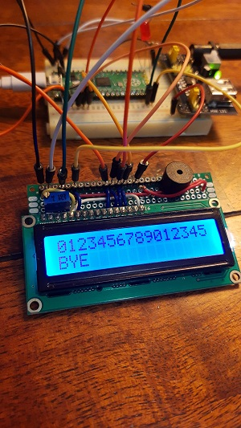

# pi-pico-LCD
LCD HD44780 controller library for pi pico (c++). 

Library for the pi pico C/C++ SDK, allowing you to steer an HD44780 type of LCD display with direct connection to 4 databits (wiring scheme is displayed below). I only tested with 16x2, but 20x2, 40x2, 16x4 and 20x4 also should work. 

The display works well on 3.3V; also the backlight. You might, however, want to power the backlight with 5V and independently from the pico for a clearer display and less power consumption from the pico. I included the wiring for this set-up. Powering the backlight from 3.3V did work at my set-up though, but was a bit bleak. 

## getting the library and compiling

do a <code>git clone https://github.com/martinkooij/pi-pico-LCD</code>
if you want to compile, you can use the provided example as a guideline. If the PICO SDK is installed according to the guidelines on the raspberry pi pico site the following should work:

````
cd pi-pico-lcd/example
mkdir build && cd build
cmake ..
make
````
or on windows
````
cd pi-pico-lcd/example
mkdir build && cd build
cmake .. -G "NMake Makefiles"
nmake
````
## Usage

Create an object of type LCDdisplay. The creator takes 8 (integer) arguments as follows:
````
LCDdisplay myDisplay(pinDB4, pinDB5, pinDB6, pinDB7, pinRS, pinE, char_width, no_lines);
`````
The first 6 arguments gives the GPIO connection pins that should be connected to the four DataBits, RS and E respectively. 

The following methods on the created object are provided:
- <code>init()</code> inititialize the connection with the LCD. Must be executed before any other operation. 
- <code>clear()</code> clear the display and put the cursor to 0,0.
- <code>goto(int c, int l)</code> got to character "c" on line "l". 0,0 is top left; 0,1 is second line, leftmost character. 
- <code>print(const char *)</code> print the string, from the cursor. If string is some characters too long to fit it will be truncated. When it is far too long to fit it will cause random behavior.
- <code>print_wrapped(const char *)</code>. Clear the screen, moves the cursor to 0,0 and tries to print the whole string on the LCD screen by wrapping.
- <code>cursor_on()</code> Shows a blinking cursor.
- <code>cursor_off()</code> No cursor shown on LCD (default).

## Examples

You can see example usage in <code>example/pico_lcd_example.cpp</code>




## Fritzing wiring scheme. 


## Release notes
27-feb-2021: First release
